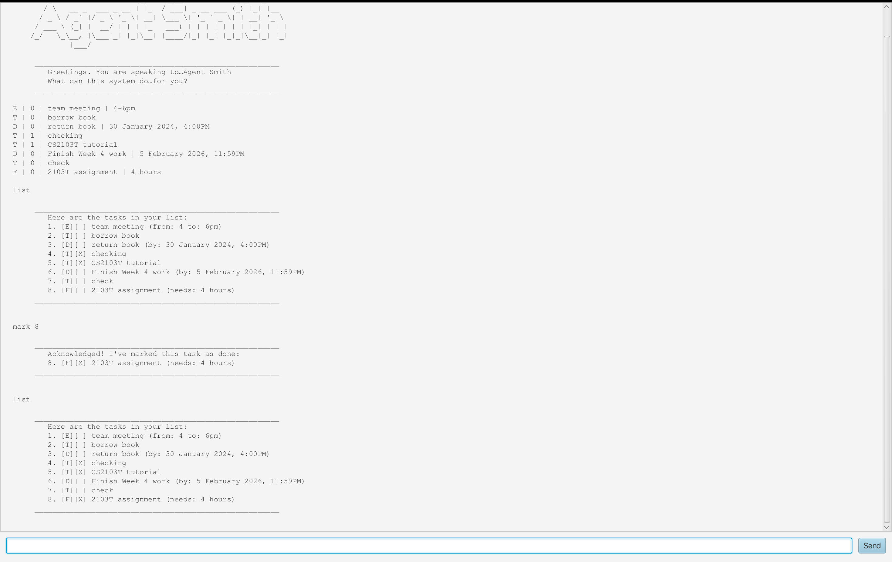

# Agent Smith User Guide



**Agent Smith** is a desktop task management chatbot that helps you track your todos, deadlines, events, and fixed-duration tasks. It features a sleek GUI while maintaining the efficiency of a Command Line Interface (CLI).

---

## Quick Start

1. Ensure you have Java 17 or above installed.
2. Download the latest `agentsmith.jar` from the releases page.
3. Copy the file to the folder you want to use as the home folder.
4. Open a terminal, navigate to that folder, and run:
   ```
   java -jar agentsmith.jar
   ```
5. Type commands in the text field and press Enter or click Send.
6. Type `help` to see all available commands.

---

## Features

### Viewing help: `help`

Shows a list of all available commands.

**Format:** `help`

---

### Adding a todo: `todo`

Adds a simple task without any date/time.

**Format:** `todo DESCRIPTION`

**Example:**
```
todo read book
```

**Expected output:**
```
Acknowledged. The task has been integrated into the system…
  [T][ ] read book
Now you have 1 tasks in the list.
```

---

### Adding a deadline: `deadline`

Adds a task with a specific deadline.

**Format:** `deadline DESCRIPTION /by DATE_TIME`

- `DATE_TIME` must be in format: `yyyy-MM-dd HHmm`

**Example:**
```
deadline submit report /by 2026-02-28 1800
```

**Expected output:**
```
Acknowledged. The task has been integrated into the system…
  [D][ ] submit report (by: 28 February 2026, 6:00PM)
Now you have 2 tasks in the list.
```

---

### Adding an event: `event`

Adds a task that spans a time range.

**Format:** `event DESCRIPTION /from START /to END`

**Example:**
```
event team meeting /from Mon 2pm /to 4pm
```

**Expected output:**
```
Acknowledged. The task has been integrated into the system…
  [E][ ] team meeting (from: Mon 2pm to: 4pm)
Now you have 3 tasks in the list.
```

---

### Adding a fixed duration task: `fixed`

Adds a task that takes a fixed amount of time but has no specific schedule.

**Format:** `fixed DESCRIPTION /needs DURATION`

**Example:**
```
fixed read sales report /needs 2 hours
```

**Expected output:**
```
Acknowledged. The task has been integrated into the system…
  [F][ ] read sales report (needs: 2 hours)
Now you have 4 tasks in the list.
```

---

### Listing all tasks: `list`

Shows all tasks in your list.

**Format:** `list`

**Expected output:**
```
Here are the tasks in your list:
1. [T][ ] read book
2. [D][ ] submit report (by: 28 February 2026, 6:00PM)
3. [E][ ] team meeting (from: Mon 2pm to: 4pm)
4. [F][ ] read sales report (needs: 2 hours)
```

---

### Marking a task as done: `mark`

Marks a task as completed.

**Format:** `mark INDEX`

**Example:**
```
mark 1
```

**Expected output:**
```
Acknowledged! I've marked this task as done:
1. [T][X] read book
```

---

### Unmarking a task: `unmark`

Marks a task as not done.

**Format:** `unmark INDEX`

**Example:**
```
unmark 1
```

**Expected output:**
```
Understood. The task remains… active:
1. [T][ ] read book
```

---

### Deleting a task: `delete`

Removes a task from the list.

**Format:** `delete INDEX`

**Example:**
```
delete 1
```

**Expected output:**
```
Acknowledged. The task has been erased from the system
  1. [T][ ] read book
Now you have 3 tasks in the list.
```

---

### Finding tasks: `find`

Searches for tasks containing a keyword.

**Format:** `find KEYWORD`

**Example:**
```
find report
```

**Expected output:**
```
[D][ ] submit report (by: 28 February 2026, 6:00PM)
[F][ ] read sales report (needs: 2 hours)
```

---

### Exiting the program: `bye`

Exits the application.

**Format:** `bye`

---

## Task Types Summary

| Type | Icon | Description |
|------|------|-------------|
| Todo | `[T]` | Simple task with no date |
| Deadline | `[D]` | Task with a deadline |
| Event | `[E]` | Task spanning a time range |
| Fixed | `[F]` | Task with fixed duration |

## Status Icons

| Icon | Meaning |
|------|---------|
| `[ ]` | Not done |
| `[X]` | Done |

---

## Data Storage

- Tasks are automatically saved to `data/tasks.txt` in the application folder.
- The file is created automatically if it doesn't exist.
- You can edit the file directly, but ensure you follow the correct format.

---

## Command Summary

| Command | Format |
|---------|--------|
| Help | `help` |
| Todo | `todo DESCRIPTION` |
| Deadline | `deadline DESCRIPTION /by yyyy-MM-dd HHmm` |
| Event | `event DESCRIPTION /from START /to END` |
| Fixed | `fixed DESCRIPTION /needs DURATION` |
| List | `list` |
| Mark | `mark INDEX` |
| Unmark | `unmark INDEX` |
| Delete | `delete INDEX` |
| Find | `find KEYWORD` |
| Exit | `bye` |
